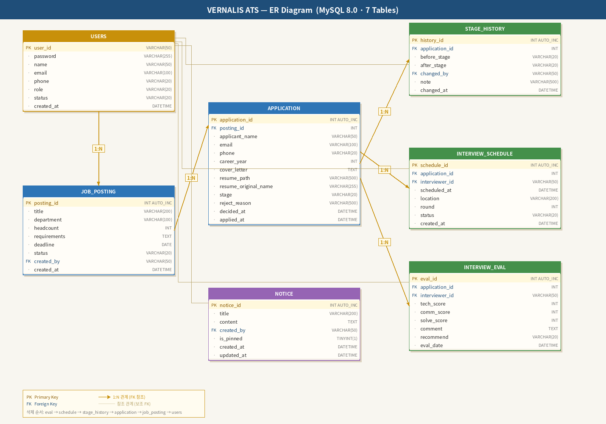
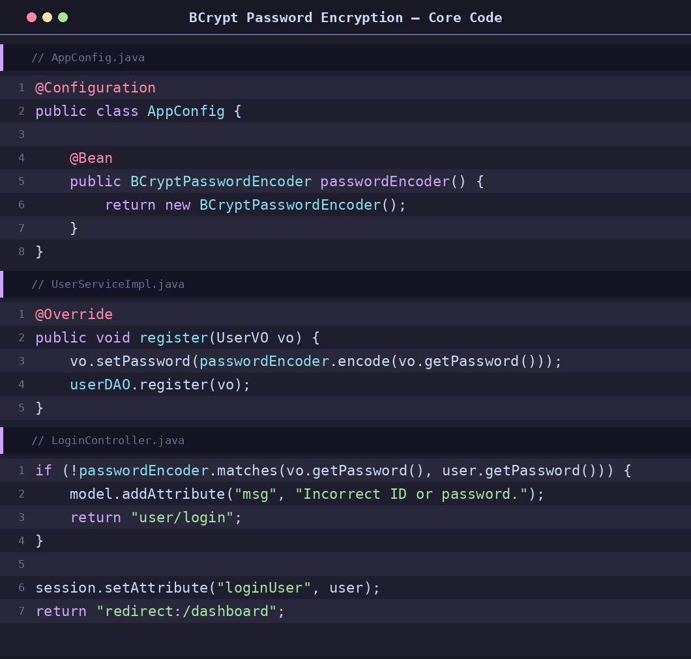
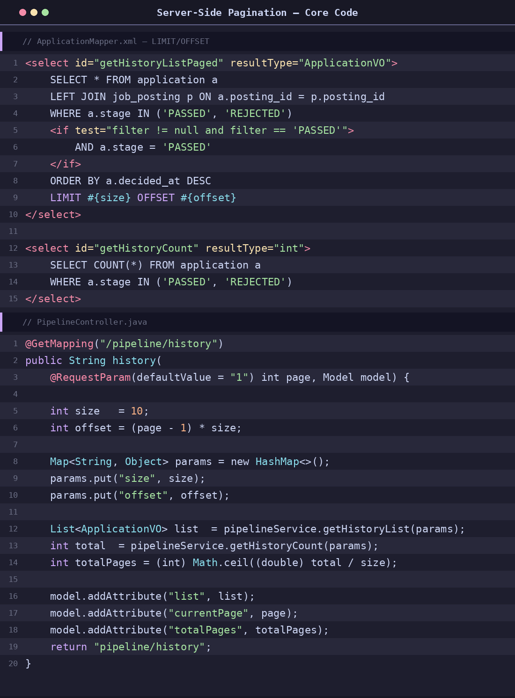
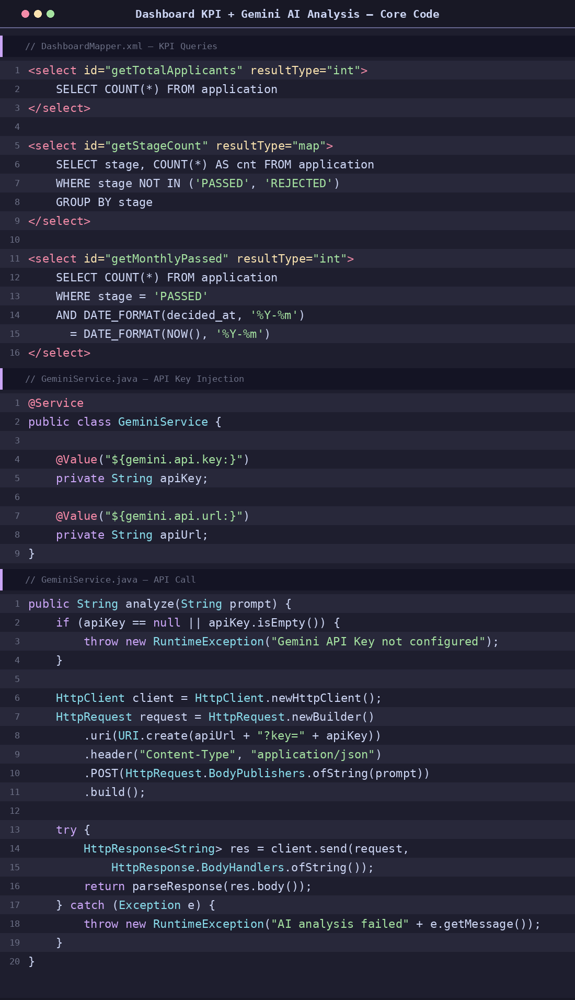
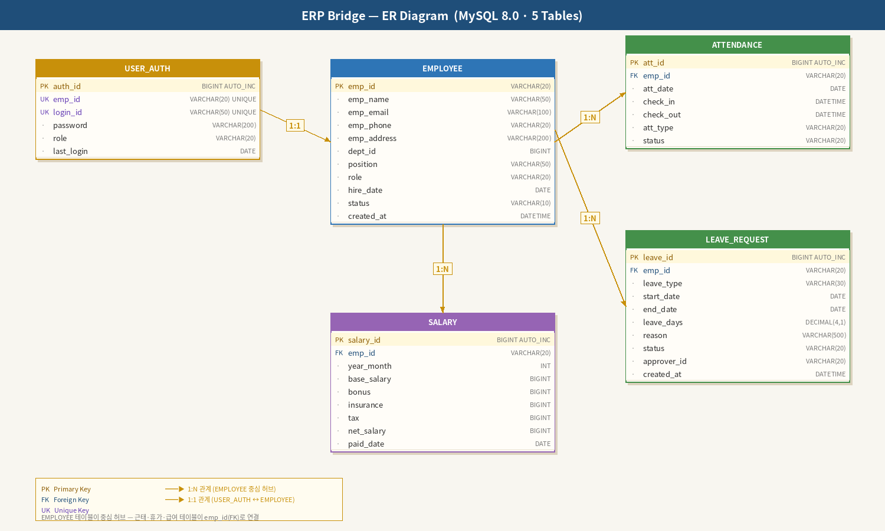
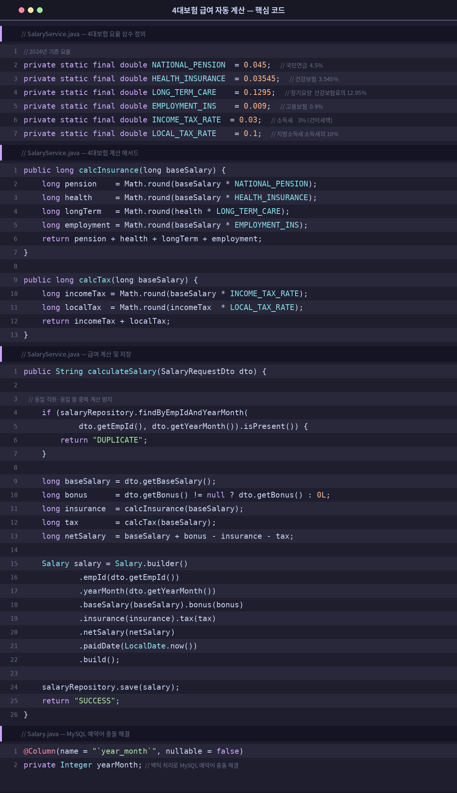

# 👋 안녕하세요, 김도현입니다

> **비즈니스 문제를 기술로 해결하는 백엔드 개발자**

Spring Boot 기반의 백엔드 개발자로, 기획부터 배포까지 전 과정을 직접 구현하며 실무 감각을 키웠습니다.  
동기 최우수 프로젝트(1위)를 수상한 VERNALIS ATS의 팀장을 맡아 DB 설계와 핵심 기능을 주도하였고,  
개인 프로젝트 ERP Bridge를 통해 실제 서비스 수준의 웹 애플리케이션을 단독 설계·구현하였습니다.

---

## 🎯 핵심 역량

- **Backend** : Spring Boot 3.2 / 3.4, JPA, MyBatis, RESTful API
- **Database** : MySQL 8.0, ER 설계, 서버사이드 페이지네이션
- **Infra** : AWS EC2 배포, GitHub 협업 (develop → main 브랜치 전략)
- **AI 연동** : Google Gemini API 실무 통합 (프롬프트 설계, JSON 파싱)
- **보안** : BCrypt 단방향 암호화, Spring Interceptor 기반 권한 제어(RBAC)

---

## 🛠 기술 스택

**Backend**  

**Frontend**  

**Database & Infra**  

**AI / API**  

---

## 📂 Projects

---

### 1. VERNALIS ATS · 채용 지원자 관리 시스템

> 팀 프로젝트 (3인) · **팀장** · 2025.05 ~ 2025.06 · **동기 최우수 프로젝트(1위) 수상**

📁 [소스코드 보러가기](https://github.com/dh4833/vernalis-ats)

#### 🎯 해결하고자 한 문제
채용 담당자가 이력서 분류, 면접 일정 조율, 합격 통보 등 반복 업무에 대부분의 시간을 쏟는 현실에 주목하였습니다.  
**채용 프로세스를 자동화하여 반복 업무를 줄이고, 담당자가 전략 수립 등 핵심 업무에 집중할 수 있도록** 시스템을 구현하였습니다.

#### 🔧 기술적 도전과 해결

**1. 대용량 데이터 조회 성능 개선 — 서버사이드 페이지네이션 전환**  
초기에는 클라이언트 사이드에서 전체 데이터를 받아 JavaScript로 페이지를 나누는 방식이었으나, 지원자 데이터 누적 시 초기 로딩 지연과 브라우저 메모리 부담이 발생하였습니다.  
→ **MyBatis LIMIT/OFFSET 기반 서버사이드 페이지네이션으로 전환**하여 데이터 양과 무관하게 일정한 응답 속도를 확보하였습니다.

**2. Gemini API 연동 시 @Value 파싱 충돌**  
API URL에 포함된 콜론(:)이 Spring `@Value`의 기본값 구분자와 충돌하여 바인딩 실패가 발생하였습니다.  
→ **기본값에서 URL을 제거하고 application.properties에만 정의**하는 방식으로 해결하였습니다.

**3. Full Spring Security 자동 설정 충돌**  
BCrypt만 필요한 상황에서 Full Security 추가로 CSRF, 자동 로그인 폼 등이 프로젝트 인증 로직과 충돌하였습니다.  
→ **spring-security-crypto만 단독 적용**하여 BCrypt 기능만 사용하는 방식으로 해결하였습니다.

#### 📌 핵심 성과
- **Google Gemini API 연동**으로 이력서 자동 분석 및 파이프라인 자동 반영 구현
- **AWS EC2 배포** 및 민감 정보 런타임 인자 분리로 보안 강화
- **RBAC 기반 권한 관리** (ADMIN / INTERVIEWER) 적용
- **서버사이드 페이지네이션 전환**으로 대용량 데이터 처리 성능 개선
- **팀장으로서 DB 스키마 설계 및 팀원 코드 통합** 주도, 동기 최우수 프로젝트(1위) 수상

#### 🗂 ER 다이어그램

#### 💻 핵심 코드
**BCrypt 단방향 암호화**

**서버사이드 페이지네이션**

**대시보드 KPI + Gemini AI 분석**

---

### 2. ERP Bridge · 중소기업 경량형 통합 ERP

> 개인 프로젝트 · 2025.03 ~ 2025.05

📁 [소스코드 보러가기](https://github.com/dh4833/erp-bridge)

#### 🎯 해결하고자 한 문제
대기업 중심의 SAP·Oracle ERP는 도입 비용과 학습 곡선이 높아 중소·중견기업이 접근하기 어렵습니다.  
**중소기업이 쉽게 도입할 수 있는 웹 기반 경량형 ERP를 직접 설계·구현**하여, 인사·근태·급여·연차 업무를 하나의 플랫폼에서 처리할 수 있도록 하였습니다.  
이 프로젝트의 경험은 이후 VERNALIS ATS 기획의 직접적인 영감이 되었습니다.

#### 🔧 기술적 도전과 해결

**1. MySQL 예약어 충돌 — year_month 컬럼**  
급여 테이블 설계 시 `year_month`가 MySQL 예약어와 충돌하여 JPA 쿼리 생성 오류가 발생하였습니다.  
→ **Entity에 `@Column(name = "\`year_month\`")` 백틱 처리**로 근본 원인을 해결하였습니다.

**2. 사번 자동 생성 중복 충돌**  
직원 삭제 후 재등록 시 사번 중복이 발생할 수 있는 구조였습니다.  
→ **do-while 루프와 existsById() 조합**으로 미사용 사번을 자동 할당하는 방어 로직을 구현하였습니다.

#### 📌 핵심 성과
- **4대보험(국민연금·건강보험·장기요양·고용보험) 및 세금 자동 계산** 로직 구현
- **JPA 기반 도메인 설계**로 EMPLOYEE 테이블을 중심 허브로 하는 관계형 구조 완성
- **소프트 삭제 방식**으로 퇴직 직원의 근태·급여 이력 보존
- **동일 월 중복 계산 방지** 등 실무 요구사항 반영

#### 🗂 ER 다이어그램

#### 💻 핵심 코드
**4대보험 급여 자동 계산**

---

## 📜 기타 활동

| 활동 | 내용 | 시기 |
|---|---|---|
| 논문 경진대회 장려상 | 고령화 사회 대비 메디컬 보조 서비스 플랫폼 **OnCare** 구상 | 대학 재학 중 |
| **특허 출원** (심사 진행 중) | 다중 서명 기반 공급망 추적 및 정품 인증을 위한 사용자 보상 연동 블록체인 플랫폼 및 그 방법 (출원번호: 10-2025-0187770) | 2025.12 |
| 학생연구원 | Python 크롤링 기반 KCI 학술 논문 및 뉴스 데이터 자동 수집·전처리 (**수작업 대비 80% 시간 단축**) | 대학 재학 중 |

---

**"기술과 경영 사이, 그 접점에서 가치를 만드는 개발자 김도현이었습니다."**

